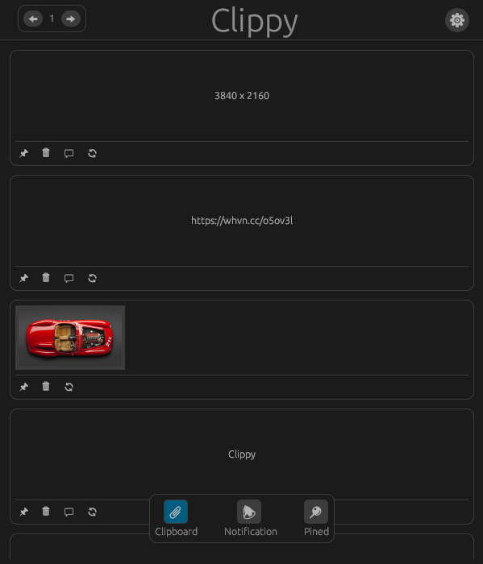

### `clippy`

[](https://github.com/dhanushl0l/clippy/releases)
[](https://github.com/dhanushl0l/clippy)

Clippy is a cross-platform clipboard and notes manager that syncs across your devices.

🚀 **Project Status: Early Development**  
Clippy is in the initial stages of development. If you're interested, contributions are welcome!

## Demo



## Contributions

We welcome all contributions — whether it's reporting bugs, suggesting improvements, or submitting code.

- Please refer to the [testing branch](https://github.com/dhanushl0l/clippy/tree/testing) for the latest development work. Contributions should be made to this branch.
- To report bugs or request features, use the [GitHub Issues](https://github.com/dhanushl0l/clippy/issues) page.


## Roadmap

Below is our planned development roadmap. Features and priorities may change over time based on feedback.

### Phase 1: Core Features (In Progress)

- [x] Basic clipboard history
- [x] Build a basic ui
- [x] Note-taking functionality

### Phase 2: Enhancements & Improvements

- [x] Advanced settings
- [ ] End-to-end encryption for sync
- [x] Multi-device sync
- [x] Platform-specific packaging

### Phase 3: Stable Release & Beyond

- [ ] UI customization
- [ ] Platform-specific optimizations
- [ ] Landing Page & Documentation
- [x] Start Mobile app Development

## Installation _(Alpha – for testing only, not ready for production use)_

### Linux

Run the following command in your terminal:

```bash
curl -s https://raw.githubusercontent.com/dhanushl0l/clippy/main/build-linux/install.sh | bash -s -- -r
```

### Windows

Download and install the `.msi` installer from the [Releases page](https://github.com/dhanushl0l/clippy/releases).

## License

Clippy is licensed under the **GNU General Public License v2.0 (GPL-2.0-only)**.  
See the [LICENSE](./LICENSE) file for more details.

## Issues & Feature Requests

- Issues & Feature Requests: [GitHub Issues](https://github.com/dhanushl0l/clippy/issues)


⭐ **Star this repo to show your support!**
